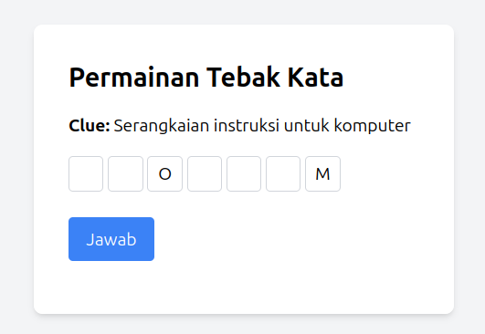

# Tebak Kata Game

## Deskripsi

Tebak Kata adalah permainan berbasis web sederhana yang menguji kemampuan pemain dalam menebak kata berdasarkan petunjuk yang diberikan. Permainan ini dikembangkan menggunakan PHP dan PostgreSQL untuk backend, serta HTML dan Tailwind CSS untuk frontend.

## Fitur

- Pemilihan kata acak dari database
- Petunjuk (clue) untuk membantu pemain menebak kata
- Sistem penilaian berdasarkan ketepatan tebakan
- Kemampuan untuk menyimpan skor pemain
- Opsi untuk mengulang permainan

## Persyaratan Sistem

- PHP 7.0 atau lebih tinggi
- PostgreSQL
- Web server (misalnya Apache, Nginx)

## Instalasi

1. Clone repositori ini ke direktori web server Anda.
2. Buat database PostgreSQL baru bernama `asah_otak`.
3. Import struktur database berikut.

   ```sql
   CREATE TABLE master_kata (
       id SERIAL PRIMARY KEY,
       kata VARCHAR(255) NOT NULL,
       clue VARCHAR(255) NOT NULL
   );

   CREATE TABLE point_game (
       id SERIAL PRIMARY KEY,
       nama_user VARCHAR(255) NOT NULL,
       total_point INT NOT NULL
   );

   ```

4. Input data untuk master kata, seperti berikut:
   ```sql
   INSERT INTO master_kata (kata, clue) VALUES
   ('KUCING', 'Hewan peliharaan yang suka mengeong'),
   ('KAPAL', 'Kendaraan yang digunakan di laut'),
   ('BOLA', 'Benda bulat yang sering digunakan untuk permainan'),
   ('MEJA', 'Furnitur yang digunakan untuk tempat meletakkan barang'),
   ('KOMPUTER', 'Alat elektronik yang digunakan untuk mengolah data'),
   ('BUKU', 'Kumpulan halaman yang berisi tulisan atau gambar'),
   ('PESAWAT', 'Kendaraan udara yang digunakan untuk terbang'),
   ('LAPTOP', 'Komputer portabel yang mudah dibawa kemana-mana');
   ```
5. Sesuaikan pengaturan koneksi database di file PHP:
   ```php
   $host = 'localhost';
   $dbname = 'asah_otak';
   $user = 'postgres';
   $password = '1234';
   ```
6. Pastikan web server Anda dikonfigurasi untuk menjalankan PHP.

## Cara Bermain

1. Buka aplikasi di browser web Anda.
2. Anda akan melihat sebuah petunjuk dan kotak-kotak untuk memasukkan tebakan.
3. Masukkan tebakan Anda ke dalam kotak-kotak tersebut.
4. Klik tombol "Jawab" untuk mengirimkan tebakan Anda.
5. Sistem akan menghitung skor berdasarkan ketepatan tebakan Anda.
6. Setelah menjawab, Anda dapat menyimpan skor atau mencoba lagi.



## Sistem Penilaian

- +10 poin untuk setiap huruf yang benar dan di posisi yang tepat
- -2 poin untuk setiap huruf yang salah

## Kontak

Oki Nurul Abada
